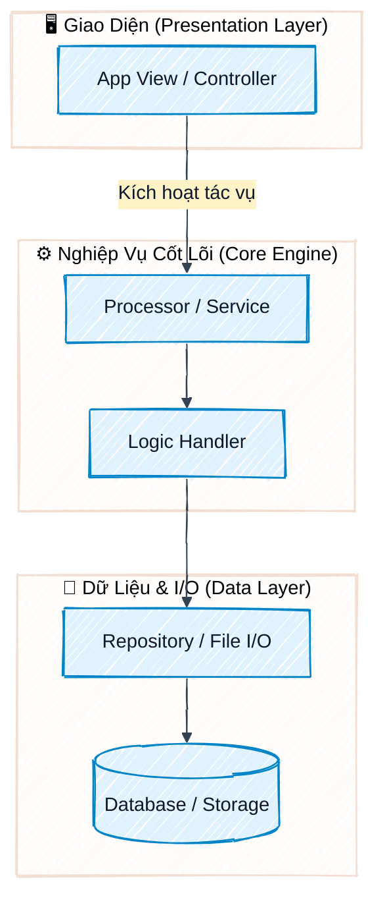
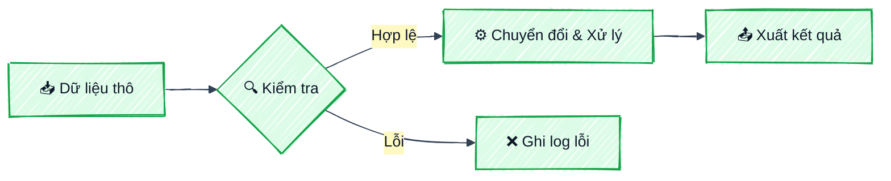
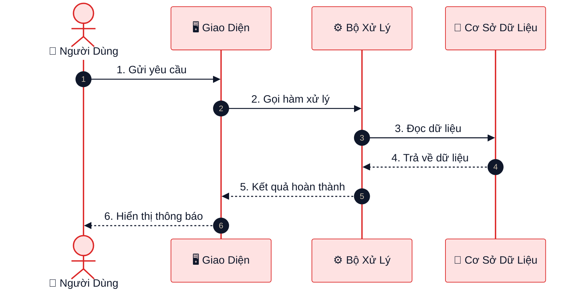

# Excali-Flow Skill: Visual Architecture & Diagramming Protocol (v3)

## Verified capability boundary

- Python analysis uses the standard-library AST. JavaScript/TypeScript, Go, and Rust use deterministic language-aware extraction of declarations and imports; unsupported code is labelled as a structural scan.
- Generated HTML embeds packaged Mermaid 11.12.2 and Panzoom 4.5.1, so rendering and pan/zoom do not require a browser network connection.
- The HTML viewer is **Excalidraw-style**. Use `--excalidraw-out <file>` or `--with-excalidraw` to also create an editable native `.excalidraw` scene.
- `--watch` excludes generated HTML and companion scene files. `--install-hook` preserves existing hooks and requires `--force-hook` only to replace a hook already marked as Excali-Flow-managed.
- Editorial SVG/HTML is an original local implementation, independent of diagram-design. Use `--editorial-out` with `--visual-type architecture|sankey|wardley|journey` and `--canvas document|slide|social`.
- Sankey, Wardley, and journey outputs require a factual JSON brief via `--visual-data`. The generator validates the brief and fails before writing an artifact when values, references, ranges, or density are invalid.

## Editorial output for publication

Use the editorial path when the final artifact is for a slide, blog, whitepaper, or pitch. It uses a restrained paper/ink/accent system, compact title/subtitle hierarchy, generous whitespace, and a fidelity receipt. It does not use remote fonts, scripts, images, stylesheets, or material from diagram-design.

```powershell
# Architecture from a local codebase, ready for a 16:9 slide
py -3 .agents\skills\excaliflow\scripts\generate_diagram.py --dir . --editorial-out architecture.svg --visual-type architecture --canvas slide

# Sankey, Wardley, or journey from a factual JSON brief
py -3 .agents\skills\excaliflow\scripts\generate_diagram.py --editorial-out journey.html --visual-type journey --visual-data journey.json --canvas document
```

Brief rules: Sankey has 2-12 nodes and positive links between known nodes; Wardley positions use `evolution` and `value` from 0 to 1; journey has 2-12 ordered stages with `name`, `action`, and `sentiment` from -2 to 2. The generated receipt declares whether its source was local analysis or a supplied brief.

Skill này biến Antigravity IDE thành một chuyên gia kiến trúc hình ảnh (**Visual Software Architect**), có khả năng tự động phân tích cấu trúc mã nguồn bất kỳ (Python, Node.js, Go, Rust, v.v.) hoặc nạp trực tiếp đồ thị tri thức nâng cao (**Graphify Knowledge Graph** `graphify-out/graph.json` / Understand Knowledge Graph), tạo các sơ đồ Mermaid theo phong cách vẽ tay phác thảo (**Hand-Drawn / Excalidraw Style** với Rough.js) và xuất ra giao diện Web tương tác độc lập (**Single-File HTML**) không phụ thuộc server.

---

## 🎯 Khi Nào Kích Hoạt Skill Này?

1. Khi người dùng yêu cầu:
   - *"Vẽ sơ đồ kiến trúc cho dự án"*
   - *"Trực quan hóa đồ thị tri thức / cộng đồng kiến trúc Graphify"*
   - *"Trực quan hóa luồng dữ liệu / quan hệ giữa các hàm và class"*
   - *"Chuyển đổi Mermaid sang giao diện vẽ tay đẹp như Excalidraw có Zoom/Pan và Sidebar thu gọn"*
   - *"Tự động hóa xuất sơ đồ HTML kiến trúc cho codebase"*
2. Khi tuân thủ **Điều luật 8 (.antigravityrules - Visual Architecture & Diagramming Protocol)** trước khi code tính năng mới hoặc refactor.

---

## 🚀 1. Công Cụ Tự Động Hóa (Universal CLI Generator)

Script sinh sơ đồ toàn năng được đặt sẵn tại:
`C:\Users\Admin\.codex\skills\excaliflow\scripts\generate_diagram.py` (hoặc `C:\Users\Admin\.gemini\config\skills\excaliflow\scripts\generate_diagram.py`)

### Thứ tự ưu tiên phân tích (Analysis Pipeline):
1. **Knowledge Graph Ingestion (Ưu tiên cao nhất)**:
   - Tự động phát hiện `graphify-out/graph.json` (hoặc `.understand-anything/knowledge-graph.json`).
   - Trích xuất cộng đồng kiến trúc (Architectural Communities & Hyperedges), các nút trung tâm (God nodes / High-degree components), và các liên kết phụ thuộc/luồng dữ liệu để dựng biểu đồ Mermaid độ chính xác cao nhất.
2. **AST & Project Tree Scanner (Fallback)**:
   - Nếu không có đồ thị tri thức sẵn có, tự động quét AST (Python `ast`), cấu trúc thư mục và tập tin để tạo sơ đồ tổng thể và sơ đồ quan hệ hàm/class.

### Các lệnh chạy phổ biến trên bất kỳ dự án nào:

```powershell
# 1. Quét dự án hiện tại và mở giao diện xem ngay trên trình duyệt:
python "C:\Users\Admin\.codex\skills\excaliflow\scripts\generate_diagram.py" --open

# 2. Quét một dự án ở thư mục bất kỳ và chỉ định file đầu ra:
python "C:\Users\Admin\.codex\skills\excaliflow\scripts\generate_diagram.py" --dir "D:\MyProject" --out "D:\MyProject\architecture_viewer.html" --open

# 3. Bật chế độ Watch Mode (tự động cập nhật sơ đồ mỗi khi lưu file Ctrl+S):
python "C:\Users\Admin\.codex\skills\excaliflow\scripts\generate_diagram.py" --watch

# 4. Tự động cài đặt Git Pre-commit / Post-commit Hook vào dự án:
python "C:\Users\Admin\.codex\skills\excaliflow\scripts\generate_diagram.py" --install-hook
```

---

## 🎨 2. Cấu Hình Mermaid Chuẩn Phong Cách Excalidraw (Hand-Drawn)

Khi viết hoặc sinh mã Mermaid, AI **BẮT BUỘC** khai báo khối cấu hình `look: 'handDrawn'` ở đầu biểu đồ để kích hoạt engine **Rough.js** và font vẽ tay:

### Header Cấu Hình Tiêu Chuẩn:
```mermaid
%%{init: {'theme': 'base', 'themeVariables': { 'primaryColor': '#e0f2fe', 'primaryBorderColor': '#0284c7', 'primaryTextColor': '#0f172a', 'secondaryColor': '#fef3c7', 'secondaryBorderColor': '#d97706', 'secondaryTextColor': '#0f172a', 'tertiaryColor': '#f3e8ff', 'tertiaryBorderColor': '#9333ea', 'tertiaryTextColor': '#0f172a', 'lineColor': '#334155', 'fontSize': '15px' }, 'look': 'handDrawn'}}%%
```

---

## 📐 3. Bộ Mẫu Sơ Đồ Mermaid Chuẩn Excali-Flow

### Mẫu 1: Sơ đồ Kiến trúc Phân tầng (Architecture Flowchart)


### Mẫu 2: Sơ đồ Luồng Dữ liệu (Data Pipeline)


### Mẫu 3: Sơ đồ Tuần tự (Sequence Diagram)


---

## 🌟 4. Tính Năng Giao Diện Web Độc Lập Được Tạo Ra (v2):
* **Nền giấy nhám chuẩn Excalidraw**: Phông nền canvas ấm áp đặc trưng (`#fdfbf7` với họa tiết chấm bi chấm mờ).
* **Đồ thị nét vẽ tay (Rough strokes)**: Tích hợp Mermaid v11 Hand-Drawn look kết hợp font chữ vẽ tay (Shantell Sans / Caveat / Virgil).
* **Zoom & Pan mượt mà (@panzoom/panzoom v4.5.1)**:
  - Hỗ trợ cuộn chuột phóng to / thu nhỏ linh hoạt.
  - Kéo thả (drag-to-pan) toàn bộ không gian vẽ.
  - Thanh công cụ Floating Toolbar: Nút Phóng to (`➕`), Thu nhỏ (`➖`), Về mặc định (`🎯`), Vừa khung hình (`📐 Fit to Screen`), cùng hiển thị tỷ lệ phần trăm trực tiếp (`100% badge`).
* **Sidebar Thu Gọn Linh Hoạt (Collapsible Sidebar)**:
  - Nút chuyển đổi ẩn/hiện bảng mã nguồn (`#toggle-sidebar` và `#btn-collapse-sidebar`).
  - Phím tắt tiện lợi `Ctrl+B` (hoặc `Cmd+B`) để mở rộng tối đa 100% diện tích màn hình hiển thị sơ đồ.
  - Chuyển động hoạt họa mượt mà bằng CSS transitions (`cubic-bezier`).
* **Live Editor & Export Đa Dạng**:
  - Biên tập trực tiếp mã Mermaid với phản hồi tức thì (`⚡ Cập Nhật Sơ Đồ`).
  - Nút xuất file **PNG chất lượng cao (2x Retina)** và **SVG Vector**.
